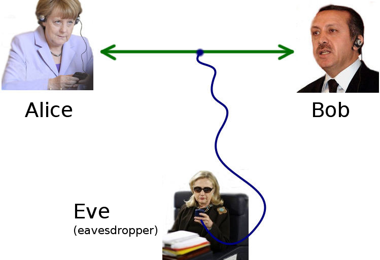

# Public Key Pinning

Сетевое соединение с применением TLS (HTTPS, WSS, etc...) является безопасным до тех пор, пока злоумышленник способен только слушать, но не подменять сетевой трафик. 

  

По [старой доброй традции](https://ru.wikipedia.org/wiki/%D0%90%D0%BB%D0%B8%D1%81%D0%B0_%D0%B8_%D0%91%D0%BE%D0%B1) пассивным слушателем обычно называют Еву, которая может в пассивном режиме перехватывать все, что пишут друг другу Алиса и Боб. Т.к. весь трафик между ними зашифрован, то ничего плохого не может произойти и Ева останется ни с чем.

Но бывает и по-другому


Такая ситуация возможна, если злоумышленник контролирует сетевое оборудование жертвы. Подробнее эта атака описана [здесь](https://ru.wikipedia.org/wiki/%D0%90%D1%82%D0%B0%D0%BA%D0%B0_%D0%BF%D0%BE%D1%81%D1%80%D0%B5%D0%B4%D0%BD%D0%B8%D0%BA%D0%B0). Мы же сосредоточимся на защите от нее.

## Как сделать прикрепление сертификата

Для начала определимся с терминологией. Очень часто люди называют разными именами одну и ту же вещь и об этом стоит помнить. Можно встретить такие называния этого механизма:

- SSL pinning
- TLS pinning
- Public Key Pinning
- Certificate pinning
- Pinning (внезапно!)

Чаще всего под этими всеми названиями имеется одно и то тоже, но если уверенности нет, то лучше уточнить.

### Откуда взять pin-ы

Получить с помощью утилиты `openssl` введя в консоли команду `openssl s_client -connect host.com:443 | openssl x509 -pubkey -noout | openssl pkey -pubin -outform der | openssl dgst -sha256 -binary | openssl enc -base64`. На выходе получится строчка вида `pdkohGteOwFsD/BToXM7kZ2OfQmZrxHoB8k8Vl6eYJk=`. Это и будет pin.

---

Получить с помощью библиотеки OkHttp (не обязательно из android приложения) c помощью такого кода:

```java
     String hostname = "publicobject.com";
     CertificatePinner certificatePinner = new CertificatePinner.Builder()
         .add(hostname, "sha256/AAAAAAAAAAAAAAAAAAAAAAAAAAAAAAAAAAAAAAAAAAA=")
         .build();
     OkHttpClient client = OkHttpClient.Builder()
         .certificatePinner(certificatePinner)
         .build();

     Request request = new Request.Builder()
         .url("https://" + hostname)
         .build();
     client.newCall(request).execute();
```

После выполнения этого кода, в консоле/logcat-е появятся строчки вида:

```
 javax.net.ssl.SSLPeerUnverifiedException: Certificate pinning failure!
   Peer certificate chain:
     sha256/afwiKY3RxoMmLkuRW1l7QsPZTJPwDS2pdDROQjXw8ig=: CN=publicobject.com, OU=PositiveSSL
     sha256/klO23nT2ehFDXCfx3eHTDRESMz3asj1muO+4aIdjiuY=: CN=COMODO RSA Secure Server CA
     sha256/grX4Ta9HpZx6tSHkmCrvpApTQGo67CYDnvprLg5yRME=: CN=COMODO RSA Certification Authority
     sha256/lCppFqbkrlJ3EcVFAkeip0+44VaoJUymbnOaEUk7tEU=: CN=AddTrust External CA Root
   Pinned certificates for publicobject.com:
     sha256/AAAAAAAAAAAAAAAAAAAAAAAAAAAAAAAAAAAAAAAAAAA=
   at okhttp3.CertificatePinner.check(CertificatePinner.java)
   at okhttp3.Connection.upgradeToTls(Connection.java)
   at okhttp3.Connection.connect(Connection.java)
   at okhttp3.Connection.connectAndSetOwner(Connection.java)
```   
Нас будет интересовать самый первый pin `sha256/afwiKY3RxoMmLkuRW1l7QsPZTJPwDS2pdDROQjXw8ig=`

---

Попросить ваших backend-разработчиков дать вам sha256 хэш от публичного ключа сертификата сервера.

### Рекомендуемая реализация (с помощью OkHttp)

Скорее всего в вашем проекте уже используется эта библиотека и вам нужно будет просто модифицировать **Builder** с помощью которого создается HTTP-клиент, следующим образом:

```kotlin
val builder = OkHttpClient.Builder()
                ...
                .certificatePinner(getPinner())
                ...

private fun getPinner(): CertificatePinner {
    val host = Uri.parse(WEBAPI_URL).host
    val sha256Cert = "pdkohGteOwFsD/BToXM7kZ2OfQmZrxHoB8k8Vl6eYJk="
    return if (BuildConfig.DEBUG) {
        CertificatePinner.DEFAULT
    } else {
        CertificatePinner.Builder()
                .add(host, "sha256/$sha256Cert")
                .build()
    }
}
```

### Альтернативная реализация (Network Security Config)

Если минимальная поддерживаемая версия API для в вашем проекте равна **24**, тогда можно последовать рекомендациям OWASP и сделать прикрепление с помощью одного лишь Network Security Config, как это показано [здесь](https://github.com/Fi5t/android-security-cookbook/blob/master/%D0%97%D0%B0%D1%89%D0%B8%D1%82%D0%B0%20%D1%81%D0%B5%D1%82%D0%B5%D0%B2%D0%BE%D0%B3%D0%BE%20%D1%81%D0%BB%D0%BE%D1%8F/Network%20Secruity%20Config.md).

### Реализация для аскетов (HttpUrlConnection)
TBD

### Реализация для дзен-буддистов (NDK)
TBD

## Полезные ссылки

- [Все, что необходимо знать о технологии HTTP Public Key Pinning (HPKP)](https://www.securitylab.ru/analytics/479602.php)
- [OWASP Certificate and Public Key Pinning (en)](https://www.owasp.org/index.php/Certificate_and_Public_Key_Pinning)
- [Security with HTTPS and SSL (en)](https://developer.android.com/training/articles/security-ssl)
